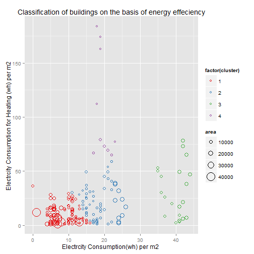
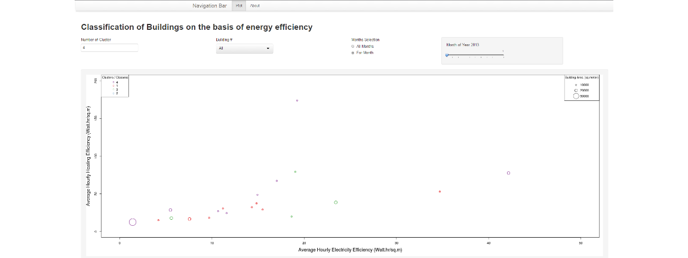

## Why to classify for energy effeciency

Two main reasons; 

1. Isolate the energy in-effecient buildings and identify the problems.


2. Isolate the energy effecient buildings to establish the good practices.

## Main highlights of the analysis

1. Grouping of buildings into any number of classes by using K-means clustering on basis of two types of energy effeciency.

  i.  Electricity usage effeciency.   
  
  ii. Electricity usage effeciency for purpose of heating the buildings.


2. Observing how energy effeciency patterns of various buildings change during differents months of a year.  


--- 

## Data Sets

There are two main data sets for this analyses.

1. Energy consumption matrix : A comma separated file with aggregated average hourly value for each building and respective month of year 2013. This pre-processed data is generated through another project, [Using Big data analytics for energy effeciency](https://github.com/hazznain/BigData_for_Energy_Efficiency). 

2. Address File: List of anonymized names of building with there masked addresses and respective ground floor areas for calculating energy effecinecies. 

## Classification Technique

We used K-means clustering to classify building on the basis of energy efficiency using predefined number of classes e.g. 4 classes corresponding to highly, regular,low and lowest effecient categories.

--- &twocol

## Visualizing the Classification

*** =left

```r
source("apply_kmeans.R")
```

 

*** =right

- Each point represents combined energy efficiency (electricity + heating) of a building in a particular month.
- Color of the points represent the class / cluster / group.
- Size of the points represent the size categories. Rounded to the nearest category.

---
## Interactivity with Shiny 

An easy to use interactive [R Shiny App](https://hussnain.shinyapps.io/EnergyEfficiency_Classification/) is available for analyzing how k-means clustering groups the buildings into configureable number of groups and then how this classification is being impacted by change of seasons during an year. The "About" page is available as help content to use the application.

 


